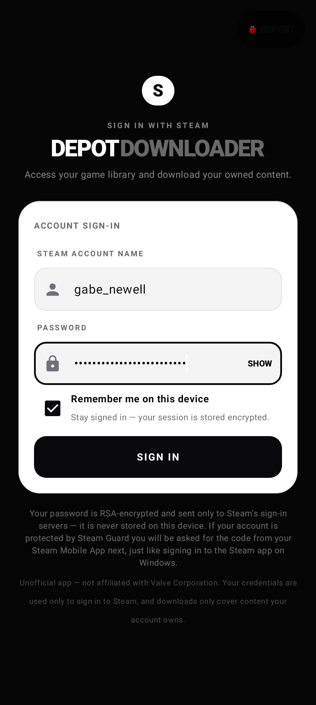
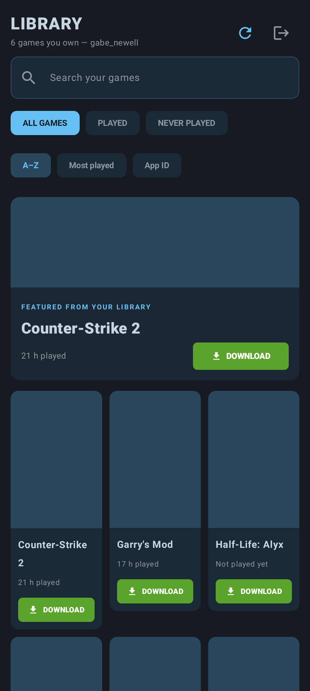

# DepotDownloader Mobile

An Android app that signs you in to Steam — **over Steam's real CM protocol**,
the same one the desktop client uses — shows the game library of the signed-in
account, and downloads games **your account owns** from Valve's real CDN with
the same pause/resume safety guarantees as Steam for Windows.

> **Unofficial.** Not affiliated with, endorsed by, or connected to Valve
> Corporation. See [Disclaimer](#disclaimer) below.

This release replaces the earlier web-only sign-in + simulated CDN with a
native Steam session built exactly the way [GameNative](https://github.com/utkarshdalal/GameNative)
runs Steam on Android — see [docs/GAMENATIVE_NOTES.md](docs/GAMENATIVE_NOTES.md).

## ⬇️ Get the latest APK

<a id="get-the-latest-apk"></a>

<p>
  <a href="https://github.com/Shankers8811/Steam-Downloader-2/releases/latest"></a>
  <a href="https://github.com/Shankers8811/Steam-Downloader-2/releases/latest"></a>
  
</p>

| Download | File | What you get |
| --- | --- | --- |
| 📱 **Android app (debug APK)** | [**Download the latest `DepotDownloader-debug.apk`**](https://github.com/Shankers8811/Steam-Downloader-2/releases/latest/download/DepotDownloader-debug.apk) | The newest build — **every successful build on `main` republishes the same [release](https://github.com/Shankers8811/Steam-Downloader-2/releases/latest)**, so this link never goes stale |
| 🏷️ **Version stamp** | [`VERSION.txt`](https://github.com/Shankers8811/Steam-Downloader-2/releases/latest/download/VERSION.txt) | Version name, build number, commit and build date of exactly that APK |
| ✅ **Checksum** | [`SHA256SUMS.txt`](https://github.com/Shankers8811/Steam-Downloader-2/releases/latest/download/SHA256SUMS.txt) | SHA-256 of the APK — verify before installing |

The release title names the current version (e.g. *latest: 1.0.57*), and each
build also attaches a copy with the version in its filename
(`DepotDownloader-1.0.57-debug.apk`). Everything here is **debug-signed** — a
testing channel, not a store release; see the [Disclaimer](#disclaimer).
The same APK is force-pushed to the
[`apk-builds`](https://github.com/Shankers8811/Steam-Downloader-2/tree/apk-builds)
branch as a direct-download fallback. Install steps:
[Install the APK](#install-the-apk).

## Screenshots

| Sign-in | Library |
| --- | --- |
|  |  |

Captured from the real screens by the CI screenshot job
(`AppScreenshotsTest`, Pixel 8 viewport) — not mock-ups.

## What the app does

| Requirement | Where it lives |
| --- | --- |
| Sign-in screen (account name + password) | `ui/screens/auth/LoginScreen.kt` |
| Steam Guard / 2FA (code from the Steam Mobile App, email code, or approve-in-app prompt) | `data/auth/SteamAuthManager.kt` — a JavaSteam `IAuthenticator` bridges the 2FA challenge to the UI; "enter a code instead" during app approval uses `sendSteamGuardCode` |
| Real CM session (WebSocket CM transport, cached server list, auto-reconnect) | `data/steam/SteamRuntime.kt` |
| Remembered login ("remember me") | `data/auth/CredentialVault.kt` (AES-256/GCM in AndroidKeyStore) + CM `logOn` with the persisted **refresh token** — no password re-entry |
| Library of the logged-in user | `LibraryScreen.kt` / `LibraryViewModel.kt` → `IPlayerService/GetOwnedGames` with the session access token (no API key needed) |
| License validation before download (separately-sold DLC excluded) | `data/license/LicenseValidator.kt` (+ `IUserService/CheckAppOwnership`) on top — and the download engine itself enforces ownership per account licenses from the CM session |
| Real depot downloads (manifests, depot keys, chunk decompression, checksums) | `data/download/DepotDownloadManager.kt` wrapping **JavaSteam's DepotDownloader** (DepotDownloader port, native on the JVM/Android) |
| Pause mid-download without corruption + resume later | Per-depot chunk staging in `<installDir>/.DepotDownloader/`; resume passes `verify = true` (full re-verification) and continues at chunk boundaries |
| Safe to move files to PC | Per-chunk checksum verification; files that have finished installing are listed in RECENTLY INSTALLED — those are whole. At COMPLETED the whole folder is safe to move |
| Estimated time, internet speed, storage write speed | Chunk telemetry: compressed bytes/s = network, uncompressed bytes/s = effective write rate → hero stats card + foreground notification |
| Delete all downloads (full-device purge) | Danger-zone card with two-step confirmation |

### The download pipeline

```
VALIDATING_LICENSE → ALLOCATING → DOWNLOADING → VERIFYING → COMPLETED
                                       ↘ PAUSED  (resume any time, even after app restart)
```

* Content arrives as ~1 MiB depot chunks over Valve's CDN; each chunk is
  decompressed (gzip/VZip/**zstd**/LZMA — hence the `zstd-jni` and `xz`
  dependencies) and checksum-verified **before** it reaches disk.
* The `.DepotDownloader` staging ledger per depot records completed chunks —
  pause, process death or a reboot resume from exactly those boundaries, and
  resumed sessions re-verify existing content (`verify = true`) instead of
  trusting it.
* Depot ownership is enforced twice: an up-front license report (web
  validation of the base app + each DLC) and the engine's CM-side
  `accountHasAccess` check with auto-licensing for free-to-play.
* Install destination is a **real filesystem path** —
  `Android/data/<package>/files/SteamLibrary/steamapps/common/<Title>` —
  visible to your PC over USB. (SAF document-tree destinations were removed:
  they are not real paths and silently break native file writers.)
* The phone asks for the **Windows x64** depot selection, because the files
  are meant to be moved to a PC — identical to what GameNative does.

## Sign-in, Steam Guard (2FA) and privacy

* You sign in with your **regular Steam account name and password** — the same
  credentials as the desktop client. The password is RSA-encrypted by Steam's
  own key exchange and is **never stored** on the device.
* **Steam Guard** works the same as the official app: a code from the Steam
  Mobile App (or the emailed code), or an *approve this sign-in* prompt that
  you confirm in the Steam Mobile App ("enter a code instead" is available
  there too).
* Tick **Remember me** and later launches sign you in from a refresh token
  that is AES-256/GCM-encrypted with a hardware-backed AndroidKeyStore key —
  no password or 2FA round-trip on every launch. Signing out forgets it.
* Credentials are used **only to sign in to Steam** — the app keeps no
  telemetry and sends nothing anywhere else.
* If Steam answers **InvalidPassword** although your password is correct,
  re-type it slowly (the fields disable autocorrect and the account name is
  trimmed automatically — keyboards love to insert invisible changes), and
  make sure no password manager filled the field with an old password.

## Install the APK

The app is distributed as a **debug-signed APK** (see the disclaimer — this is
a preview/testing channel, not a production release).

### 1. Get the APK

* **Releases page (recommended)** — the newest build is always the repo's
  **[latest release](https://github.com/Shankers8811/Steam-Downloader-2/releases/latest)**.
  That release is republished on every successful build, so its title shows the
  running version and these links always point at the newest APK:

  | Asset | What it is |
  | --- | --- |
  | [`DepotDownloader-debug.apk`](https://github.com/Shankers8811/Steam-Downloader-2/releases/latest/download/DepotDownloader-debug.apk) | the APK (stable filename — always the newest build) |
  | [`DepotDownloader-<version>-debug.apk`](https://github.com/Shankers8811/Steam-Downloader-2/releases/latest) | the same APK with the version pinned in the filename (e.g. `DepotDownloader-1.0.57-debug.apk`) |
  | [`VERSION.txt`](https://github.com/Shankers8811/Steam-Downloader-2/releases/latest/download/VERSION.txt) | version, versionCode, commit, build date |
  | [`SHA256SUMS.txt`](https://github.com/Shankers8811/Steam-Downloader-2/releases/latest/download/SHA256SUMS.txt) | SHA-256 of both APKs — verify if you downloaded over an untrusted network |

* **Which version am I getting?** CI stamps every published build with
  `1.0.<build number>`, and the same number is the APK's Android `versionCode`
  — so a newer APK always installs as an in-place **update** over an older one
  (same signing key). After installing, *Settings ▸ Apps ▸ DepotDownloader ▸
  App info* shows that version, and `VERSION.txt` on the release carries the
  same stamp plus the commit it was built from.
* **`apk-builds` branch (direct download)** — CI force-pushes the newest
  debug APK + `VERSION.txt` + checksum to the [`apk-builds`](https://github.com/Shankers8811/Steam-Downloader-2/tree/apk-builds)
  branch on every successful build. That branch is a **mirror of the same
  rolling build**, for downloading without the Releases UI. If GitHub shows
  *"Sorry about that, but we can't show files that are this big right now"* on
  the 35 MB file, click **Raw** to download it.
* **Build it yourself** — Android Studio: *Build ▸ Build APK(s)*; or command
  line with JDK 17 + Android SDK: `gradle :app:assembleDebug` (the repo
  deliberately ships no wrapper; CI pins Gradle 9.3.1). More detail in
  [docs/TESTING.md](docs/TESTING.md).

### 2. Sideload on the phone

1. Copy the APK to the phone (USB/MTP, Bluetooth, a chat app's "Saved
   Messages" — anything works).
2. **Settings ▸ Security ▸ Install unknown apps** → allow your file manager,
   then tap the APK → **Install**. The one-time "unknown source" warning
   appears because the build is debug-signed.
3. Open the app → sign in (Steam Guard supported). The app is **HMS-safe**:
   no Google Play services, no Firebase — it runs on Huawei/EMUI devices
   (e.g. a Nova 7i) exactly like on Google phones.

### 3. After downloading a game: move it into Steam (PC)

1. Copy the game folder (`steamapps/common/<Game>`) from the phone to your
   PC's Steam library folder (e.g. `C:\Program Files (x86)\Steam\steamapps\common\`).
2. In desktop Steam: **Library ▸ the game ▸ Install**, pointing it at the same
   library folder. Steam discovers the pre-existing files and just verifies
   them — only missing parts download.
3. Run **Verify integrity of game files** (right-click → Properties →
   Installed Files) before launching.

## Manual testing

CI covers the APK boot on an API-34 emulator, the download engine, and the
UI scenario suites — but the following still deserve a by-hand pass on a real
phone (use the in-app **🐞 Report** button if anything crashes):

- [ ] Real login with Steam Guard (mobile-app code *and* approve-in-app)
- [ ] Library sync against your real account
- [ ] An actual download of a game you own
- [ ] Pause / resume mid-download, including after killing the app
- [ ] Moving a completed download into PC Steam

## Disclaimer

* This is an **unofficial, hobby project**. It is not affiliated with,
  endorsed by, or connected to **Valve Corporation**. Steam and the Steam
  logo are trademarks of Valve Corporation.
* The app **only downloads games your Steam account owns** (or that are free
  to play). It verifies licenses before downloading and will not fetch
  content your account is not entitled to. You are responsible for complying
  with Steam's terms of service.
* **Your credentials are used only to sign in to Steam.** The password is
  never stored; the optional "remember me" token is encrypted with a
  hardware-backed device key and never leaves the device except to
  authenticate with Steam.
* The committed **`debug.keystore` is debug-only** — its certificate (and
  password) are public in this repository on purpose, so every automated
  build is installable over the previous one. **It must never sign a release
  build.** Release signing uses a separate keystore supplied via environment
  variables (`KEYSTORE_PATH`, `STORE_PASSWORD`, `KEY_PASSWORD`) and is not
  part of this repository.

## Development & testing

* JVM/Robolectric scenario suites (`AuthUiScenariosTest`, `LibraryUiScenariosTest`,
  `DownloaderUiScenariosTest`, `DownloadEnginePersistenceTest`) run on every
  push together with an API-34 emulator boot smoke — see the two workflows in
  [`.github/workflows/`](.github/workflows).
* CI also records the screenshots above (`AppScreenshotsTest`), builds the
  debug APK for every push, and republishes the rolling
  [latest release](#get-the-latest-apk) with that build — versioned
  `1.0.<build number>`, checksummed, and mirrored to `apk-builds`. Only pushes
  publish; pull requests just build and test.
* Device-specific notes (Huawei Nova 7i / HMS, publishing options) live in
  [docs/TESTING.md](docs/TESTING.md); the architecture study for the native
  Steam stack is in [docs/GAMENATIVE_NOTES.md](docs/GAMENATIVE_NOTES.md).

## License

Licensed under the **Apache License 2.0** — see [LICENSE](LICENSE).

Third-party components (all compatible with Apache-2.0):
[JavaSteam](https://github.com/Longi94/JavaSteam) and the JavaSteam
DepotDownloader port (`in.dragonbra:*`) are **MIT**; `zstd-jni` is
**BSD-2-Clause**; `xz`/`org.tukaani:xz` is **public domain/0BSD**; Kotlin,
Coroutines, Jetpack Compose, Room, Moshi, OkHttp and AndroidX are
**Apache-2.0**; JUnit is **EPL-2.0** (test-only).
